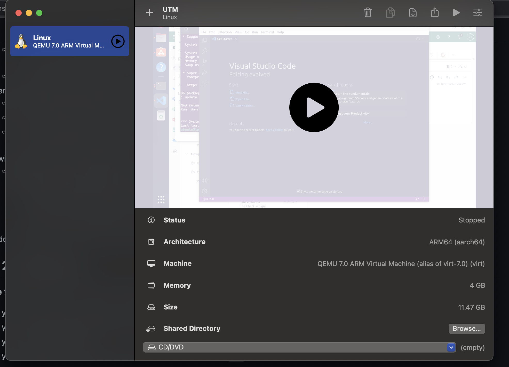

## Lab 07

- Name: Prarthana Neupane
- Email: neupane.18@wright.edu

## Part 1 Answers

1. Steps to configure virtual hardware:
 1.1 Open UTM 
 1.2 Click on create Virtual Machine 
 1.3 Click on Virtualize 
 1.4 Click on Linux 
 1.5 Provide ISO file 
 1.6 Continue the setup with default options 
 1.7 Setup user in guest OS 
 1.8 Restart VM when the Setup is complete 
 1.9 Eject ISo file 

2. 
3. Steps to download an ISO: 
For Mac M1 ARM ISO needs to be downloaded by going to the following link: 
https://cdimage.ubuntu.com/jammy/daily-live/current/
4. Steps to use ISO on VM: 
 When setting up the VM , click on browse ISO and locate the Iso using finder. 
5. Steps to install your distribution:
 We need to ensure that the architectuire that is being set up is ARM64(aarch64). We can then continue with the default values when setting up. 
 
6. Steps to boot to disk after install: 
6.1 Open UTM ,
 6.2 Then we can click on the play button where it lists the VM
7. Steps to use full screen mode: 
On Mac we can click on the green full screen button to go on full screen mode.
8. 

## Part 2 Answers 

1. Steps to change desktop background.
1.1 Go to setting 
1.2 Click on Background 
1.3 Select a new image 
1.4 Apply
2. Steps to open a web browser.
 Click on the firefox icon to open the browser
3. Steps to install VSCode. 
3.1 Download the version of VS code 
3.2 Executet the following Command - sudo apt install ./vscode.deb

4. Steps to connect to your AWS instance from your VM.
4.1 labsuser.pem file must be present in the guest VM 
4.2 Use the following command - ssh -i labsuser.pem ubuntu@ipaddress

