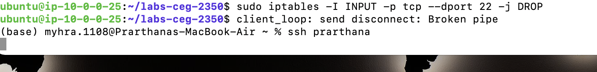

## Lab 12

- Name: Prarthana Neupane
- Email: neupane.18@wright.edu

## Part 1 Answers:

1. `tar` options:
   - `-c` Create a new archive.
   - `-v`  Verbosely list files processed.
   - `-f`   Use archive file or device ARCHIVE.  If this option is not given, tar will first examine the environment variable `TAPE'.  If it is set, its value will be used  as  the  archive  name.
              Otherwise, tar will assume the compiled-in default
   - `-z` Filter the archive through gzip(1
   - `-x` Extract files from an archive
2. Command(s): tar cvzf all_labs.tar.gz labs-ceg-2350/

## Part 2 Answers:

1. Command: sftp -i labsuser.pem ubuntu@35.170.228.42
2. `sftp` options:
   - `ls`  Display a remote directory listing of either path or the current directory if path is not specified.
   - `lls`  Display local directory listing of either path or current directory if path is not specified. 
   - `put` Upload local-path and store it on the remote machine.  If the remote path name is not specified, it is given the same name it has on the local machine.  
   - `get` Retrieve the remote-path and store it on the local machine.  If the local path name is not specified, it is given the same name it has on the remote machine. 
3. Command(s):  get all_labs.tar.gz
4. Command(s): tar -xf all_labs.tar.gz 

## Part 3 Answers:

1. sudo adduser itadmin
2. ssh-keygen
3. ssh-copy-id -i key.pub
4. ssh -i ~.ssh/key.pub itadmin@35.170.228.42

## Part 4 Answers

1. Translate to network prefixes + CIDR notation:
   - Sample: `10.0.0.0 - 10.0.1.255` = `10.0.0.0/23` OR `10.0.1.0/23`
   - `130.108.0.0 - 130.108.255.255` = 255.255.255.0
   - `10.0.0.0 - 10.0.0.255` =  255.255.255.252
   - `your_public_ip - your_public_ip` = 255.255.255.252
2. How you confirmed current rules are bad, and why are they bad. 
	sudo iptables -L
	right now the the system is set to accept all the incoming traffic which decreases our security on the system.
3. Your implementation details and **screenshot**
	sudo iptables -I INPUT -p tcp --dport 22 -j DROP
4. Something invalid:
	no we're unable to ssh into the the system

## Extra Credit Answers:

### Solve the conflict

1.
Following merge conflict arises because of variation in files
Auto-merging Lab12/problem-child.txt
CONFLICT (content): Merge conflict in Lab12/problem-child.txt
Automatic merge failed; fix conflicts and then commit the result.

2. Shows changes made to the file in improvements branch

3. Removed the characters

4. It says both files are modified

5. 

git branch improvements

git checkout improvements

vim problem-child.txt

git add .

git commit -m 'Message'

git push

git checkout master

vim problem-child.txt

git add .

git commit -m "message 2"

git push

git merge

vim problem.txt

git add .

git commit -m "fixed message"

git push
